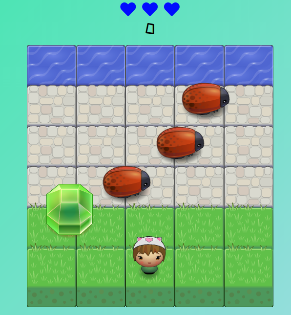

# Bugger 2: A Bugs life
  This game is a clone of the retro arcade game frogger.
  
 ## Instructions
 
- Navigate to https://buttacavoli01.github.io/retro/

-	In this game you have a Player and Enemies (Bugs).

-	The goal of the player is to reach the water, without colliding into any one of the enemies.

-	The player can move left, right, up and down.

-	The enemies move in varying speeds on the paved block portion of the scene.

-	Once the player collides with an enemy, the player moves back to the starting position and back one level.

- You have 3 lives, use them wisely

